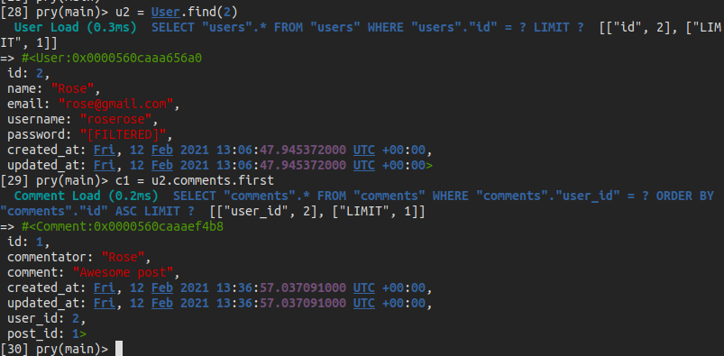

# Micro Reddit

## Getting started

- Clone the repo `https://github.com/KumarAmitt/micro-reddit.git`
- `cd` into the micro-reddit
- Run `git checkout -b micro-reddit`
- Run `git pull origin micro-reddit`
- Run `bundle install`
- Run `rails db:migrate` to get the schema

## Features

- Users can register themselves using their credentials
- Users can create posts and comment on other posts

## Working

Refer [This Article](https://www.theodinproject.com/courses/ruby-on-rails/lessons/building-with-active-record-ruby-on-rails) for more instruction and to test this project

Example:

## Author

👤 Rose Sumba

- GitHub: [@ZawadiSumba66](https://github.com/ZawadiSumba66)
- Twitter: [@zawadirose1](https://twitter.com/zawadirose1)
- LinkedIn: [rose-sumba](https://www.linkedin.com/in/rose-sumba-9b36401b5/)

👤 Kumar Amitt

- GitHub: [@githubhandle](https://github.com/KumarAmitt)
- Twitter: [@twitterhandle](https://twitter.com/ArrshAmitt)
- LinkedIn: [LinkedIn](www.linkedin.com/in/kumar-amitt)

## 🤝 Contributing

Contributions, issues and feature requests are welcome!

Feel free to check the issues page.

Show your support

Give a ⭐️ if you like this project!

## 📝 License

&copy; 2020 Amit and Rose

Permission is hereby granted, free of charge, to any person obtaining a copy
of this software and associated documentation files (the "Software"), to deal
in the Software without restriction, including without limitation the rights
to use, copy, modify, merge, publish, distribute, sublicense, and/or sell
copies of the Software, and to permit persons to whom the Software is
furnished to do so, subject to the following conditions:

The above copyright notice and this permission notice shall be included in all
copies or substantial portions of the Software.

THE SOFTWARE IS PROVIDED "AS IS", WITHOUT WARRANTY OF ANY KIND, EXPRESS OR
IMPLIED, INCLUDING BUT NOT LIMITED TO THE WARRANTIES OF MERCHANTABILITY,
FITNESS FOR A PARTICULAR PURPOSE AND NONINFRINGEMENT. IN NO EVENT SHALL THE
AUTHORS OR COPYRIGHT HOLDERS BE LIABLE FOR ANY CLAIM, DAMAGES OR OTHER
LIABILITY, WHETHER IN AN ACTION OF CONTRACT, TORT OR OTHERWISE, ARISING FROM,
OUT OF OR IN CONNECTION WITH THE 